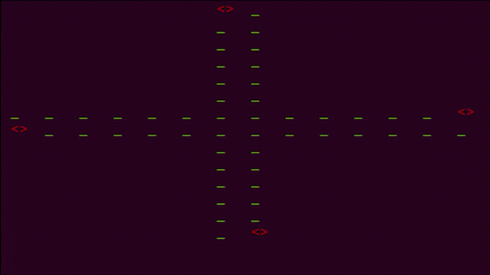
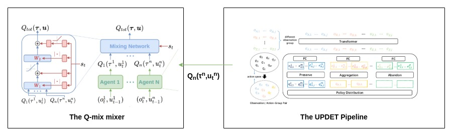
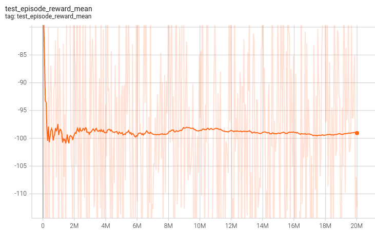
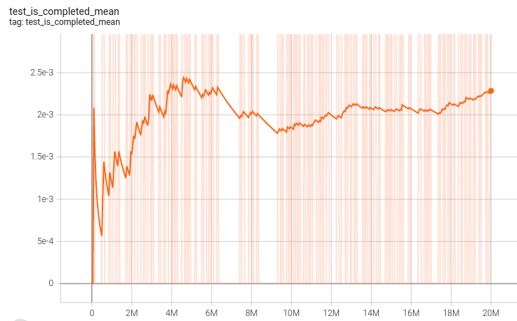
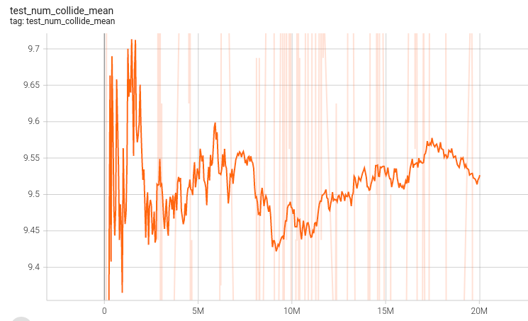
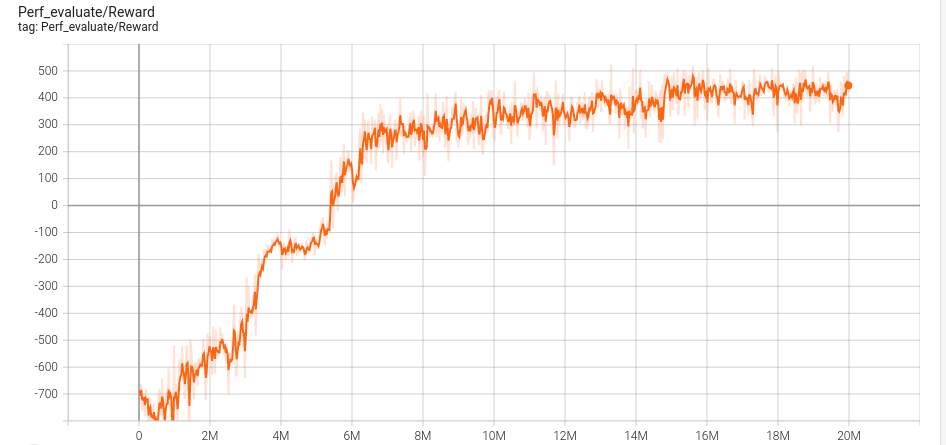
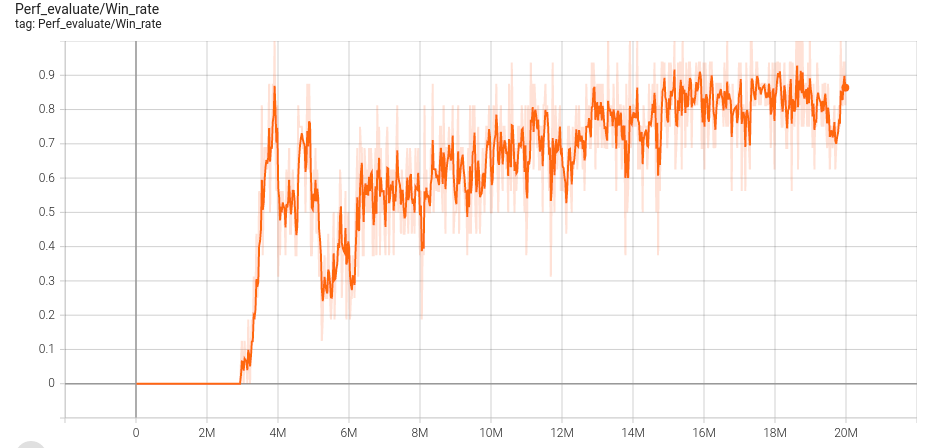
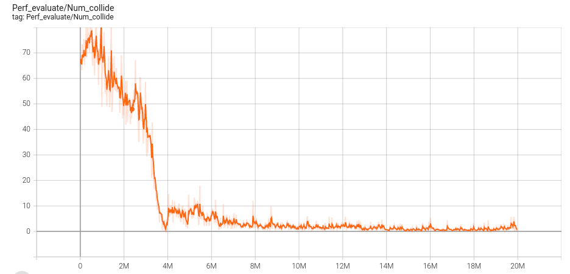

# MultiAgent Traffic Control Using Transformers

Recent advances in multi-agent reinforcement learning have been largely limited training one model from scratch for every new task. This limitation occurs due to the restriction of the model architecture related to fixed input and output di- mensions, which hinder the experience accumulation and transfer of the learned agent over tasks across diverse levels of difficulty. Among these Multi-Agent Traffic Control is a hot topic research. So, here I have implemented the **UNIVERSAL MULTI - AGENT REINFORCEMENT LEARNING VIA POLICY DECOUPLING WITH TRANSFORMERS (UPDET)** on a custom build Multiagent Traffic Env.

# Environment Used

As said before the enviroment which I have used is a custom build environemnt of Traffic control with varied difficulities and number of agents. The demo of the env is shown below.

In this project I have kept number of agent = **10** and difficulty as **medium**. One can change the difficulty and number of agents <a href="">here (add link to file here)<a/>.

# Model Architecture

 <em>Diagram representing the pipeline of the whole model used for training</em>

 
The right part of he figure is the UPDeT algorithm which is a replacement of the traditional RNN/LSTM based base model. The main reason of this replacement is the advantages of transformers based model especially UPDET as compared to the RNN/LSTM based models as explained in the paper[1]. 
The main advantages of this are :  
<ol>
<li>UPDeT-based MARL framework outperforms RNN-based frameworks by a large margin in terms of final performance on state-of-the-art centralized functions. </li>
<li>This model has strong transfer capability and can handle a number of different tasks at a time.</li>
<li>The model accelerates the transfer learning speed (total steps cost) to make it roughly 10 times faster compared to RNN-based models in most scenarios.</li>
</ol>
The left side of the figure is the Qmix mixer architecture as shown in paper[2]. The QMix can be replaced by other networks like COMA, QTRAN, VDN and IQL. But in some researches we found QMix to outperform these listed models, so, I used the Qmix out of all options. 

# Result and Inference :

## Baseline : 
I have compared the results of the UPDET with a well known Multi Agent Communication algorithm - Graph convolutional reinforcement learning, namely <a href="https://arxiv.org/pdf/1810.09202.pdf">**DGN**</a>, is instantiated based on deep Q network and trained end-to-end. The main reason of using DGN is it's based on GNN (Graph Neural Networks and has Multi-Head Attention). 

For DGN codes, go to **DGN** folder.

<table align="left">
  <tr>
    <td align="center"><B>UPDeT</B></td>
  </tr>
  <tr>
    <td align="center" colspan="2"><B>Episode Mean Rewards</B></td>
  </tr>
  <tr>
    <td align="center"></td>
  </tr>
  <tr>
    <td align="center" colspan="2"><B>Episode Mean Win rates</B></td>
  </tr>
  <tr>
    <td align="center"></td>
  </tr>
  <tr>
    <td align="center" colspan="2"><B>Episode Mean No. of Collisions</B></td>
  </tr>
  <tr>
    <td align="center"></td>
  </tr>
</table>

  
<table align="center">
  <tr>
    <td align="center"><B>UPDeT</B></td>
  </tr>
  <tr>
    <td align="center" colspan="2"><B>Episode Mean Rewards</B></td>
  </tr>
  <tr>
    <td align="center"></td>
  </tr>
  <tr>
    <td align="center" colspan="2"><B>Episode Mean Win rates</B></td>
  </tr>
  <tr>
    <td align="center"></td>
  </tr>
  <tr>
    <td align="center" colspan="2"><B>Episode Mean No. of Collisions</B></td>
  </tr>
  <tr>
    <td align="center"></td>
  </tr>
</table>

   

<em>The plots of UPDeT at left and right are using the hidden states as the masking in Self-Attentions for Transformers. (Click on the images to Zoom In)</em>
 

<table align="center">
  <tr>
    <td align="center"><B>UPDeT</B></td>
  </tr>
  <tr>
    <td align="center" colspan="2"><B>Episode Mean Rewards</B></td>
  </tr>
  <tr>
    <td align="center"></td>
  </tr>
  <tr>
    <td align="center" colspan="2"><B>Episode Mean Win rates</B></td>
  </tr>
  <tr>
    <td align="center"></td>
  </tr>
  <tr>
    <td align="center" colspan="2"><B>Episode Mean No. of Collisions</B></td>
  </tr>
  <tr>
    <td align="center"></td>
  </tr>
</table>

<em>The plots of UPDeT at left and right are using the self masking as the masking in Self-Attentions for Transformers. (Click on the images to Zoom In)</em>

  
 ## Comparision with DGN :

<table align="center">
  <tr>
    <td align="center"><B>DGN</B></td>
  </tr>
  <tr>
    <td align="center" colspan="2"><B>Episode Mean Rewards</B></td>
  </tr>
  <tr>
    <td align="center"></td>
  </tr>
  <tr>
    <td align="center" colspan="2"><B>Episode Mean Win rates</B></td>
  </tr>
  <tr>
    <td align="center"></td>
  </tr>
  <tr>
    <td align="center" colspan="2"><B>Episode Mean No. of Collisions</B></td>
  </tr>
  <tr>
    <td align="center"></td>
  </tr>
</table>

# References :

**[1]** Universal Multi-agent Reinforcement Learning via Policy Decoupling with Transformers Siyi Hu, Fengda Zhu, Xiaojun Chang, Xiaodan Liang 
**[2]** QMIX: Monotonic Value Function Factorisation for Deep Multi-Agent Reinforcement Learning
Tabish Rashid, Mikayel Samvelyan, Christian Schroeder de Witt, Gregory Farquhar, Jakob Foerster, Shimon Whiteson 
**[3]** Counterfactual Multi-Agent Policy Gradients Jakob Foerster, Gregory Farquhar, Triantafyllos Afouras, Nantas Nardelli, Shimon Whiteson 
**[4]** QTRAN: Learning to Factorize with Transformation for Cooperative Multi-Agent Reinforcement Learning Kyunghwan Son, Daewoo Kim, Wan Ju Kang, David Earl Hostallero, Yung Yi 
**[5]** Multi-Agent Deep Reinforcement Learning for Large-scale Traffic Signal Control Tianshu Chu, Jie Wang, Lara Codecà, and Zhaojian Li  
**[6]** Value-Decomposition Networks For Cooperative Multi-Agent Learning Peter Sunehag, Guy Lever, Audrunas Gruslys, Wojciech Marian Czarnecki, Vinicius Zambaldi, Max Jaderberg, Marc Lanctot, Nicolas Sonnerat, Joel Z. Leibo, Karl Tuyls, Thore Graepel  
**[7]** Attention Is All You Need: Ashish Vaswani, Noam Shazeer, Niki Parmar, Jakob Uszkoreit, Llion Jones, Aidan N. Gomez, Lukasz Kaiser, Illia Polosukhin  
**[8]** Offline Pre-trained Multi-Agent Decision Transformer: One Big Sequence Model Tackles All SMAC Tasks Linghui Meng, Muning Wen, Yaodong Yang, Chenyang Le, Xiyun Li, Weinan Zhang, Ying Wen, Haifeng Zhang, Jun Wang, Bo Xu 
**[9]** GRAPH CONVOLUTIONAL REINFORCEMENT LEARNING Jiechuan Jiang1, Chen Dun2∗, Tiejun Huang1 & Zongqing Lu Peking University, Rice University
