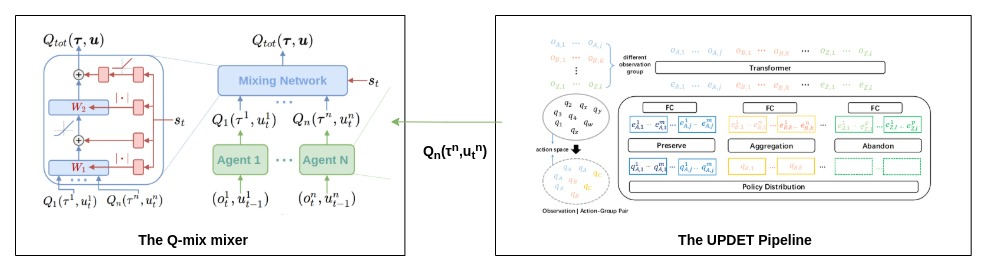

# MultiAgent Traffic Control Using Transformers

Recent advances in multi-agent reinforcement learning have been largely limited training one model from scratch for every new task. This limitation occurs due to the restriction of the model architecture related to fixed input and output di- mensions, which hinder the experience accumulation and transfer of the learned agent over tasks across diverse levels of difficulty. Among these Multi-Agent Traffic Control is a hot topic research. So, here I have implemented the **UNIVERSAL MULTI - AGENT REINFORCEMENT LEARNING VIA POLICY DECOUPLING WITH TRANSFORMERS (UPDET)** on a custom build Multiagent Traffic Env.

# Environment Used

As said before the enviroment which I have used is a custom build environemnt of Traffic control with varied difficulities and number of agents. The demo of the env is shown below.

# Model Architecture

 <em>Diagram representing the network architecture used in the training</em>

 
The right part of he figure is the UPDeT algorithm which is a replacement of the traditional RNN/LSTM based base model. The main reason of this replacement is the advantages of transformers based model especially UPDET as compared to the RNN/LSTM based models as explained in the paper[1]. 
The main advantages of this are :  
<ol>
<li>UPDeT-based MARL framework outperforms RNN-based frameworks by a large margin in terms of final performance on state-of-the-art centralized functions. </li>
<li>This model has strong transfer capability and can handle a number of different tasks at a time.</li>
<li>The model accelerates the transfer learning speed (total steps cost) to make it roughly 10 times faster compared to RNN-based models in most scenarios.</li>
</ol>

# References :

**[1]** <a href="https://arxiv.org/abs/2101.08001">UPDeT</a>: Universal Multi-agent Reinforcement Learning via Policy Decoupling with Transformers Siyi Hu, Fengda Zhu, Xiaojun Chang, Xiaodan Liang 
